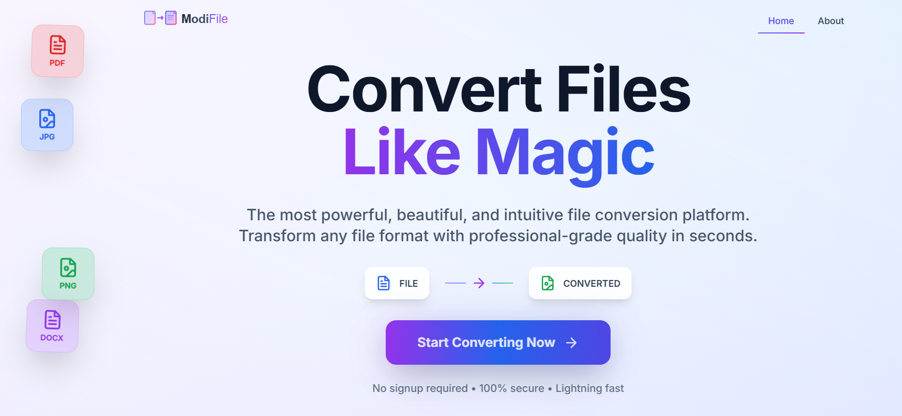
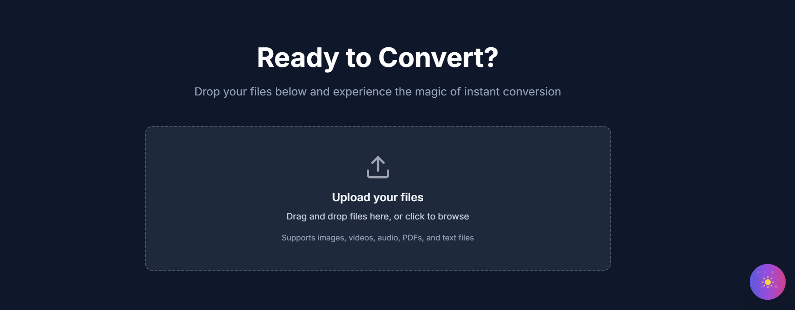
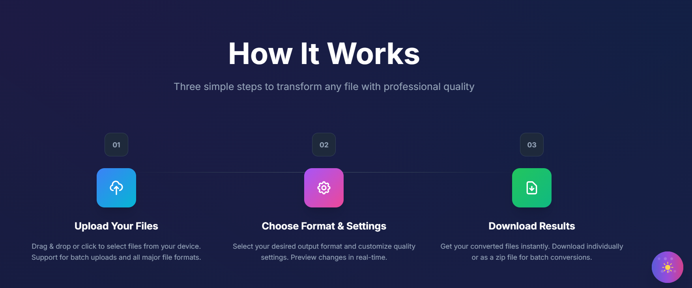
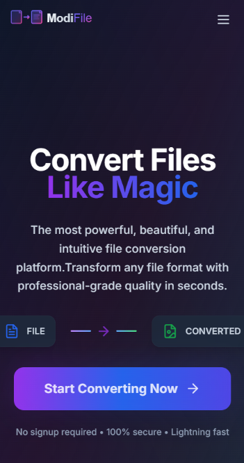

# ModiFile - Transform Files

## 🚀 Ultra-Smooth File Conversion Platform

A modern, high-performance file conversion platform built with Next.js 15, featuring buttery-smooth animations, premium glassmorphic UI, and professional-grade conversion capabilities. Transform any file format with lightning speed and zero friction.

### ✨ Key Features

- **🧈 Buttery Smooth UI** - 60fps animations with hardware acceleration for silk-like interactions
- **⚡ Lightning Fast** - WebAssembly-powered FFmpeg engine for near-native performance
- **🔒 100% Secure** - All processing happens locally in your browser - no uploads
- **📱 Mobile-First Design** - Responsive interface optimized for all devices
- **🌙 Dual Themes** - Seamless dark/light mode switching with system preference detection
- **🎯 Zero Friction** - No sign-ups, no limits, no hassle - just pure file transformation
- **🚀 Production Ready** - Deployable code with enterprise-grade optimizations

### 🎨 Design Philosophy

- **Glassmorphism Effects** - Modern frosted glass aesthetics with backdrop blur
- **Magnetic Interactions** - Smooth hover effects that feel responsive and alive
- **Liquid Animations** - Fluid transitions that make every interaction delightful
- **Professional Gradients** - Carefully crafted color schemes for premium feel
- **Accessibility First** - WCAG compliant with keyboard navigation support

### 📁 Supported Formats

#### 🖼️ **Images** (50+ formats)
- **Popular**: JPG, PNG, WEBP, AVIF, GIF, BMP, TIFF
- **Professional**: RAW, PSD, SVG, ICO, HEIC
- **Quality Options**: Lossless, High, Medium, Low compression

#### 🎥 **Videos** (30+ formats)
- **Common**: MP4, AVI, MOV, WEBM, MKV, FLV
- **Professional**: ProRes, DNxHD, H.264, H.265, VP9
- **Features**: 4K support, HDR processing, custom bitrates

#### 🎵 **Audio** (25+ formats)
- **Lossless**: FLAC, WAV, AIFF, APE
- **Compressed**: MP3, AAC, OGG, M4A, WMA
- **Professional**: High sample rates, custom bitrates

#### 📄 **Documents** (15+ formats)
- **Office**: PDF, DOCX, XLSX, PPTX
- **Text**: TXT, RTF, CSV, JSON, XML
- **Preservation**: Metadata and formatting intact

### 🛠️ Tech Stack

- **Next.js 15** - App Router with React Server Components and Turbopack
- **TypeScript** - Strict type safety with advanced configurations
- **Tailwind CSS** - Utility-first styling with custom design system
- **Framer Motion** - Hardware-accelerated animations and transitions
- **Shadcn/UI** - Premium component library with custom theming
- **FFmpeg.wasm** - WebAssembly-powered media processing engine
- **Lenis** - Smooth scrolling with custom easing functions
- **React Dropzone** - Advanced file handling with drag-and-drop

### 🎯 Performance Features

- **Hardware Acceleration** - GPU-powered animations and transforms
- **Code Splitting** - Automatic bundle optimization and lazy loading
- **Image Optimization** - Next.js Image component with WebP/AVIF support
- **Service Worker** - Offline capabilities and background processing
- **Compression** - Gzip and Brotli compression for faster loading
- **Smart Caching** - Optimized cache headers and strategies
- **Memory Management** - Efficient file handling for large media files

### 📱 UI Screenshots

#### 🏠 Hero Section - Modern Glassmorphic Design
Beautiful gradient backgrounds with floating file format badges and smooth animations



#### 🔄 Conversion Interface - Clean & Intuitive
Professional dropzone with real-time progress and instant feedback



#### ⚙️ How It Works - Step-by-Step Process
Clear workflow visualization with professional icons and descriptions



#### 📱 Mobile Interface - Responsive Design
Optimized mobile experience with touch-friendly interactions



## 🚀 Quick Start

### Prerequisites

- **Node.js 18+** - Latest LTS version recommended
- **npm/yarn/pnpm** - Package manager of choice
- **Modern Browser** - Chrome, Firefox, Safari, or Edge

### Installation

```bash
# Clone the repository
git clone https://github.com/your-username/modifile.git
cd ModiFile

# Install dependencies (choose one)
npm install
# or
yarn install
# or
pnpm install

# Start development server with Turbopack
npm run dev
```

Open [http://localhost:3000](http://localhost:3000) to see the magic ✨

### Development Commands

```bash
# Development server with hot reload
npm run dev

# Type checking
npm run type-check

# Linting and formatting
npm run lint
npm run lint:fix

# Build for production
npm run build

# Start production server
npm run start

# Full deployment check
npm run deploy
```

### Environment Configuration

Create a `.env.local` file in the root directory:

```env
# Google Analytics (optional)
NEXT_PUBLIC_GA_MEASUREMENT_ID=your_ga_measurement_id

# Development mode (optional)
NODE_ENV=development

# Custom domain (for production)
NEXT_PUBLIC_DOMAIN=https://your-domain.com
```

## 📦 Deployment Options

### 🚀 Vercel (Recommended)

Perfect for Next.js applications with zero configuration:

```bash
# Install Vercel CLI
npm i -g vercel

# Deploy to Vercel
vercel

# Or connect your GitHub repository at vercel.com
```

**Automatic Features:**
- Edge Functions for global performance
- Automatic HTTPS and CDN
- Preview deployments for PRs
- Analytics and Web Vitals monitoring

### 🌐 Netlify

Great alternative with excellent static hosting:

```bash
# Build settings
Build command: npm run build
Publish directory: out
```

Add to `next.config.js` for static export:
```javascript
/** @type {import('next').NextConfig} */
const nextConfig = {
  output: 'export',
  trailingSlash: true,
  images: { unoptimized: true }
}
```

### 🐳 Docker Deployment

For containerized environments:

```dockerfile
FROM node:18-alpine AS base
WORKDIR /app
COPY package*.json ./

FROM base AS deps
RUN npm ci --only=production

FROM base AS builder
COPY . .
RUN npm ci
RUN npm run build

FROM node:18-alpine AS runner
WORKDIR /app
ENV NODE_ENV production
COPY --from=deps /app/node_modules ./node_modules
COPY --from=builder /app/.next ./.next
COPY --from=builder /app/public ./public
COPY --from=builder /app/package.json ./package.json

EXPOSE 3000
CMD ["npm", "start"]
```

### ☁️ Other Platforms

- **Railway**: Connect GitHub repo, automatic deployments
- **Render**: Static sites and web services
- **AWS Amplify**: Full-stack deployment with CI/CD
- **DigitalOcean App Platform**: Container-based deployment

## ⚡ Performance Optimizations

### 🎨 Frontend Performance
- **Hardware Acceleration** - GPU-powered animations with `transform3d`
- **Code Splitting** - Route-based and component-based splitting
- **Image Optimization** - WebP/AVIF with responsive loading
- **Font Optimization** - Preloaded Inter font with `font-display: swap`
- **Bundle Analysis** - Webpack Bundle Analyzer integration

### 🚀 Runtime Performance
- **Service Worker** - Offline-first with background sync
- **Memory Management** - Efficient file handling for large media
- **WebAssembly** - Near-native performance for file processing
- **Streaming** - Progressive file processing for better UX
- **Caching Strategy** - Smart cache headers and service worker caching

### 📊 Monitoring & Analytics
- **Web Vitals** - Core performance metrics tracking
- **Error Boundary** - Graceful error handling and reporting
- **Performance API** - Real-time performance monitoring
- **Google Analytics** - User behavior and conversion tracking

## 🔧 Configuration & Customization

### 🎨 Theme Customization

Modify `tailwind.config.js` for custom branding:

```javascript
module.exports = {
  theme: {
    extend: {
      colors: {
        brand: {
          50: '#f0f9ff',
          500: '#3b82f6',
          900: '#1e3a8a',
        }
      },
      animation: {
        'custom-bounce': 'bounce 1s infinite',
      }
    }
  }
}
```

### ⚙️ Conversion Settings

Customize default conversion settings in `utils/convert.ts`:

```typescript
const defaultSettings = {
  quality: 'high',
  compression: 80,
  maxFileSize: 100 * 1024 * 1024, // 100MB
  supportedFormats: ['jpg', 'png', 'webp', 'mp4', 'mp3']
}
```

### 🔒 Security Configuration

Environment variables for production:

```env
# Security headers
NEXT_PUBLIC_CSP_ENABLED=true
NEXT_PUBLIC_HSTS_ENABLED=true

# Analytics
NEXT_PUBLIC_GA_MEASUREMENT_ID=G-XXXXXXXXXX

# Performance monitoring
NEXT_PUBLIC_SENTRY_DSN=your_sentry_dsn
```

## 🤝 Contributing

We welcome contributions! Please see our [Contributing Guide](CONTRIBUTING.md) for details.

### Development Workflow

1. Fork the repository
2. Create a feature branch: `git checkout -b feature/amazing-feature`
3. Commit changes: `git commit -m 'Add amazing feature'`
4. Push to branch: `git push origin feature/amazing-feature`
5. Open a Pull Request

### Code Standards

- **TypeScript** - Strict mode enabled
- **ESLint** - Airbnb configuration with custom rules
- **Prettier** - Consistent code formatting
- **Husky** - Pre-commit hooks for quality checks

## 📄 License

This project is licensed under the MIT License - see the [LICENSE](LICENSE) file for details.

## 🙏 Acknowledgments

- **FFmpeg Team** - For the incredible media processing library
- **Vercel Team** - For Next.js and deployment platform
- **Shadcn** - For the beautiful UI component library
- **Framer** - For the smooth animation library

---

<div align="center">

**Made with ❤️ by [Nitish Kumar Pandit]**

[⭐ Star this repo](https://github.com/your-username/modifile) • [🐛 Report Bug](https://github.com/your-username/modifile/issues) • [💡 Request Feature](https://github.com/your-username/modifile/issues)

</div>
